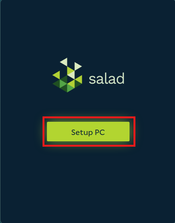
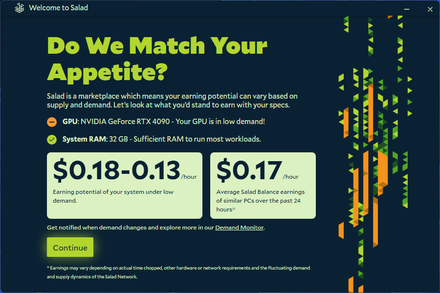
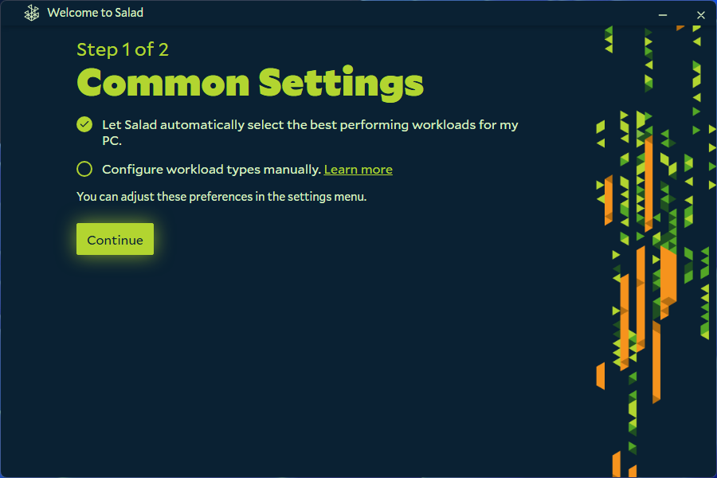

Now that you're logged in, it's time to set-up the Salad application for the first time. When you open the application,
you'll be greeted with a setup wizard to help you get started. Follow the steps in the wizard to configure your machine
and preferences.

1. Click 'Setup PC' from the Salad App.
   
2. Have a look at your system specs, and potential earning rates, then click 'Continue'.
   
3. Set Salad to automatically configure the best workloads, and then 'Continue'.
   
4. Select a target reward you'd like to aim for if you want from the Storefront, otherwise click 'Skip For Now'.
   
5. Click 'Finish Setup', and then open Salad from your System Tray.
   

---

Now that you've completed setting up Salad, you're ready to
[get your first Job](/guides/getting-started/getting-your-first-job) and start earning Salad Balance!
