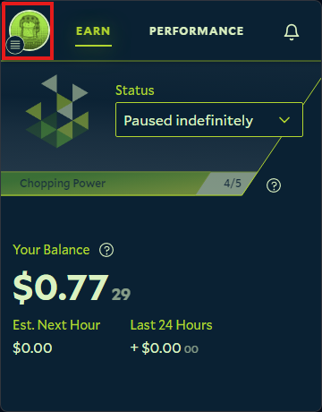
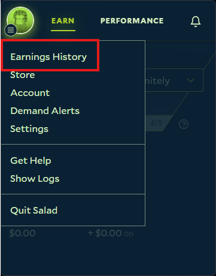

1. Open your Salad Widget

   

2. Click your Profile Picture at the top left

   

3. Click the "Earnings History" button

   

4. Your earning history will open up in your Web Browser, where you can see your current, lifetime, and past earnings
   along with a graph to show how much you've been earning
