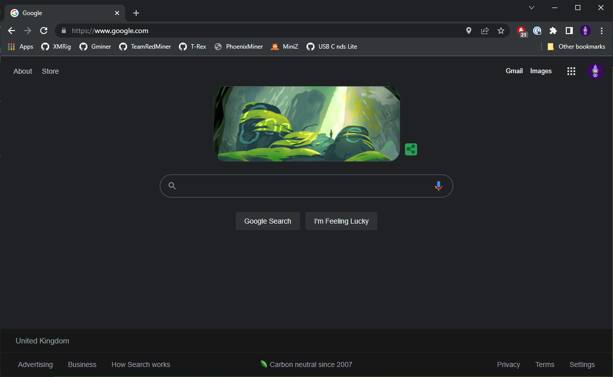
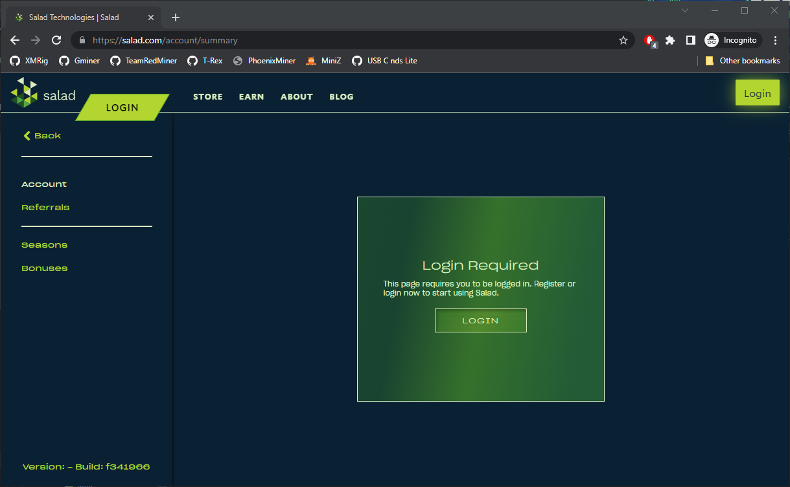
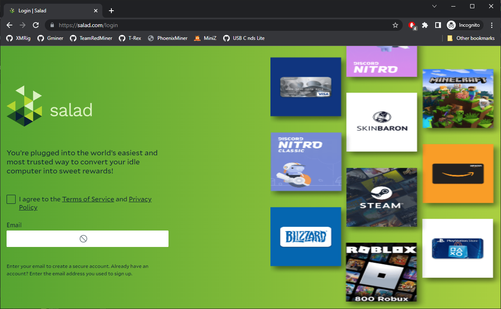
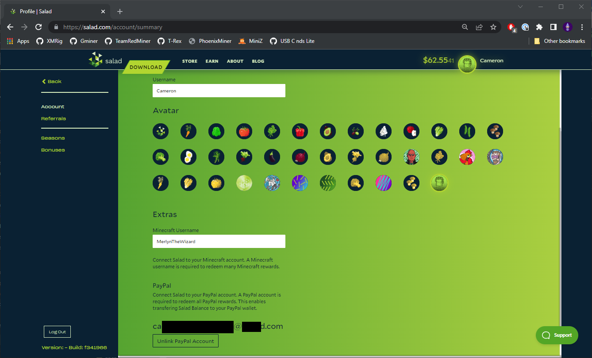

You can access your Salad profile by:

1. Opening your favorite Web Browser

   

2. Navigate to [https://salad.com/account/summary](https://salad.com/account/summary)

   

3. Log into your account (if currently logged out)

   

---

Once logged into your account, you can:

- Edit your Salad Username.
- Change your Profile Avatar.
  - Updating your Profile Avatar can take up to an hour to reflect in your Salad Widget

- Attach a Minecraft username for some Minecraft rewards.
- Connect a Google account for Google Single Sign On (SSO).
- Add a [Passkey](/docs/guides/using-salad/501-salad-app-passkeys) to your account.

