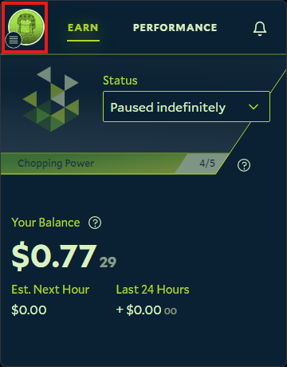
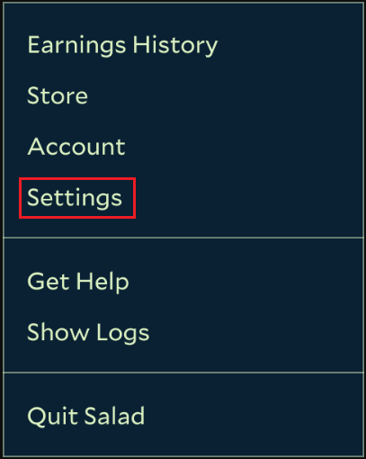

Disabling Sleep Mode on your PC will prevent your PC from automatically going to sleep whilst Chopping Salad. Disabling
this will maximise your PCs chopping potential, so we recommend turning it off.

1. Open your Salad Widget

   

2. Click your Profile Picture at the top left

   

3. Click the "Settings" button

   

4. Locate the Sleep Mode settings and click "Disable Sleep Mode"

   

Using this feature will only disable auto-sleep mode on your PC whilst plugged in. If you are using a laptop that is
unplugged, it will still go to sleep as normal. You can still manually put your PC to sleep.
