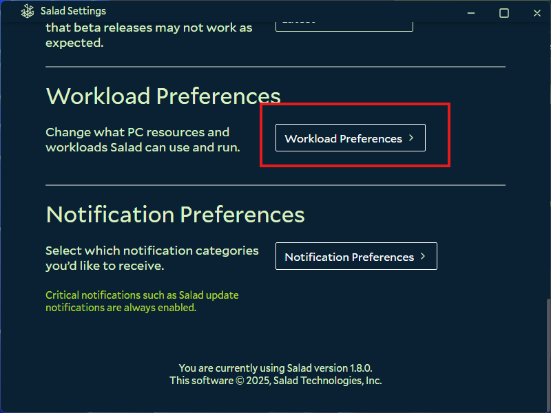

Enabling Elevated Permissions in your Salad app allows us to run some jobs as "Admin". Enabling this setting may allow
us to run certain jobs with increased earnings. You can
[learn more here](https://support.salad.com/article/241-what-are-elevated-permissions-and-should-i-enable-them).

1. Open your Salad Widget.

   

2. Click your Profile Picture at the top left.

   

3. Click the "Settings" button.

   

4. Scroll down, and open "Workload Preferences".

   

5. Scroll down slightly, and enable "Allow Elevated Permissions".
