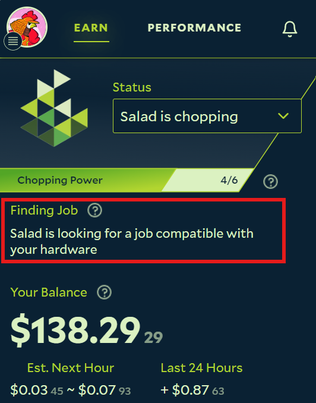

Finished setting up Salad and just started Chopping? Salad will let you know what it's up to, whether it's looking for
your next workload, downloading, or running.

Salad will try its best to let you know what it's doing, so that you have maximum control over the application and your
machine.

---

## **Finding Job**

When you're not running anything, Salad will display the "Finding Job" message, meaning that the app is actively
scouring the network for a workload that matches your machine's hardware. Note that the time it takes to look for a
workload can vary depending on the amount of workloads available, the amount of other Chefs with similar hardware
Chopping, as well as your [Salad's Chopping settings](/docs/guides/using-salad/353-salad-app-settings) (broader settings
such as enabling adult workloads, cryptomining, and bandwidth sharing can increase your earning potential).

---

## **Downloading Job**

When we find a workload, the status will update to "Downloading Job". This means that you've successfully gotten a job,
and Salad is gathering the necessary files from the internet. The amount of time spent on Downloading varies based on
your network speed as well as the size of the workload being downloaded.

---

## **Initializing Job**

Once it's done downloading, Salad will display the "Initializing Job" status. At this point, the files are on your
machine and Salad needs to unpack them and start the engine to get the workload running. This step typically takes a few
seconds to complete, though it can last up to a few minutes.

---

## **Running Job**

In the next and final step, Salad will display "Running Job". At this point, the job is running and your machine should
start generating balance.

Once the active container ends, Salad will return to a "Finding Job" status to let you know that we're actively looking
for the next job to run on your machine.
