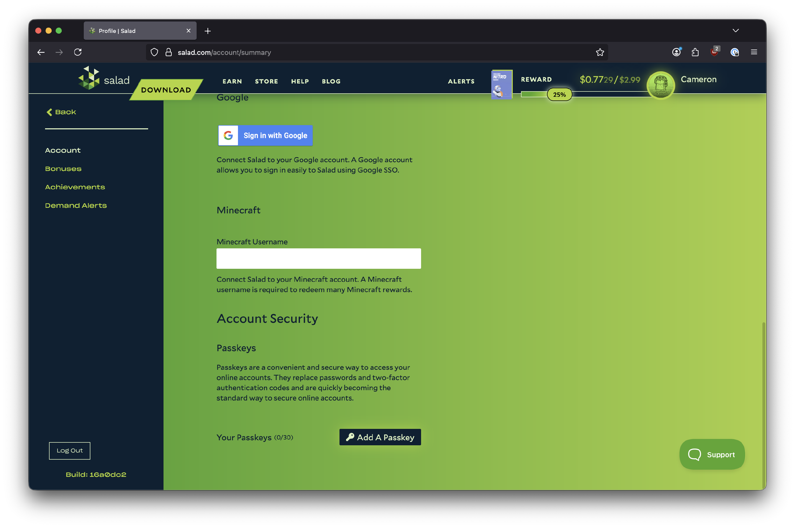

As the Salad network expands into more profitable jobs, we've introduced Passkeys to enhance the security of Chef
accounts. Passkeys work differently from passwords or one-time authentication codes. Instead, they use authentication
for your device, often biometrics or unlock pins. Chefs must manually add Passkeys within the Salad app.

**To set up Passkeys, follow these steps:**

1. Navigate to the [Salad web app](https://salad.com/account/summary) and scroll down to the **Account Security**
   section.
2. Under **Account Security**, click on the **Add a passkey** option.

   

3. Complete the OTP challenge that appears.
4. If successful, you'll see that a Passkey has been added for your browser.

<Callout type="warning">
Once a passkey is set up, it cannot be edited, removed, or bypassed by our team.
The only solution to remove passkeys or acccess protected accounts once set up is through the passkey or the
included **backup codes**.

Store your backup codes in a secure, accessible location - ideally not on the same machine or network as
the one the passkey was created on.
</Callout>

You can read more about Passkeys [here](https://www.microsoft.com/en-gb/security/business/security-101/what-is-passkey).
