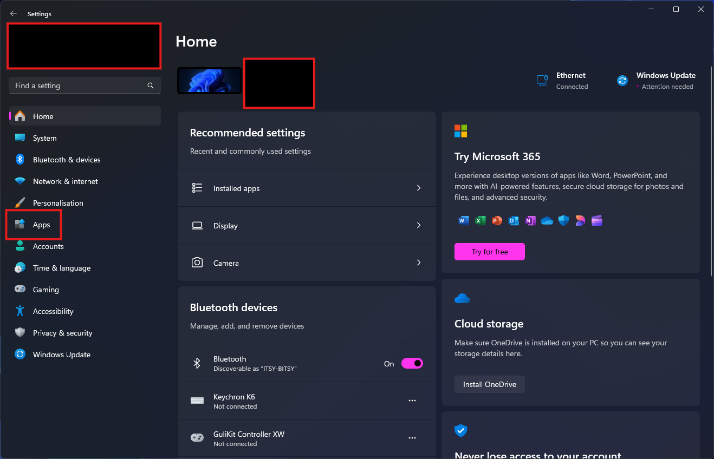
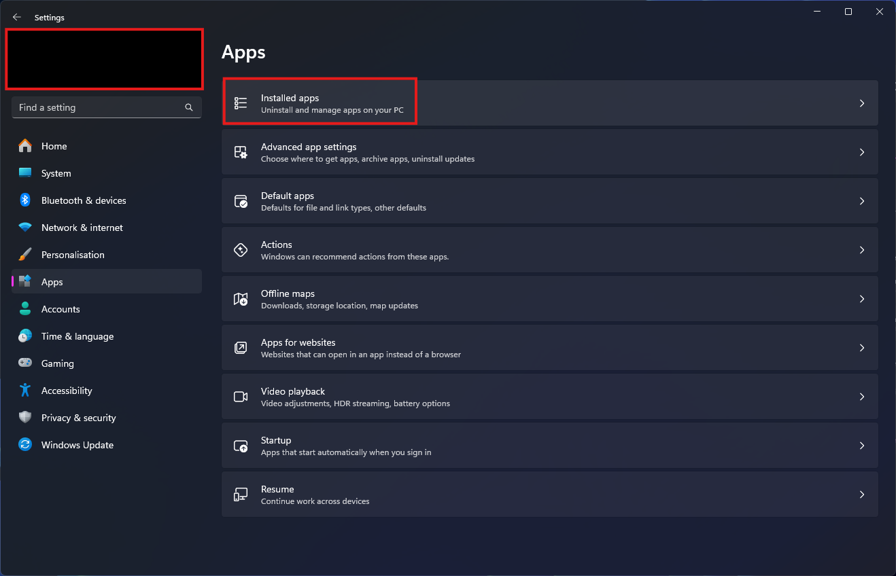
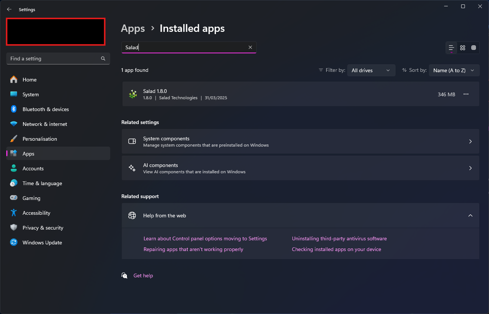

Whether you're looking to reinstall Salad because of a problem, or looking to leave us (we'll miss you!), you can find
out how to uninstall Salad here.

1. Open Windows Settings, and navigate to "Apps".

   

2. Click "Installed apps".

   

3. Use the search bar to find Salad.

   

4. Once you have located Salad, click on it, and click "Uninstall", then "Uninstall" again.
5. Allow the uninstaller to run, which will remove the application from your PC.
6. Restart your PC to finalize uninstallation.
