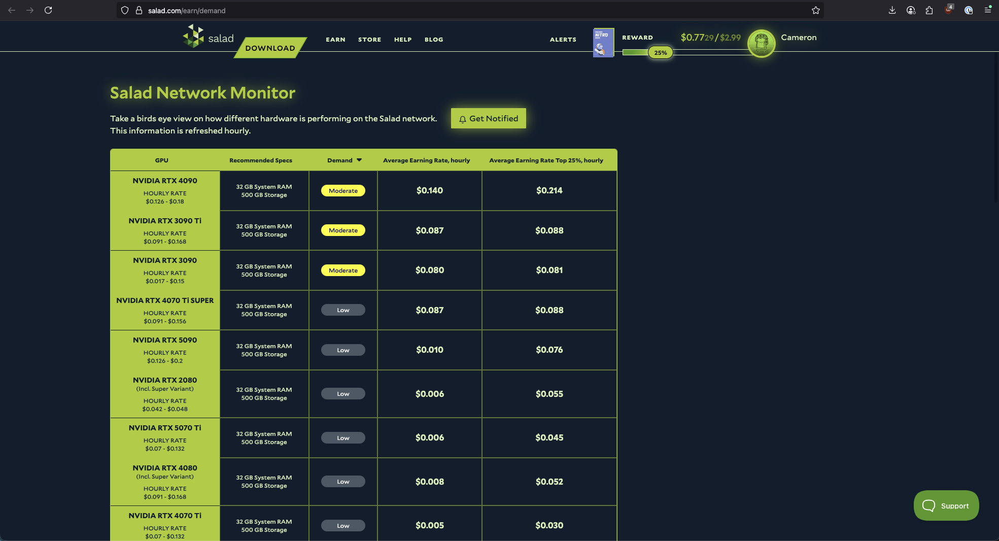
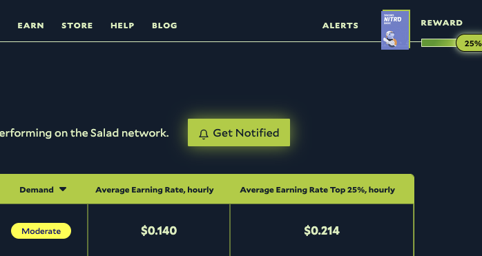
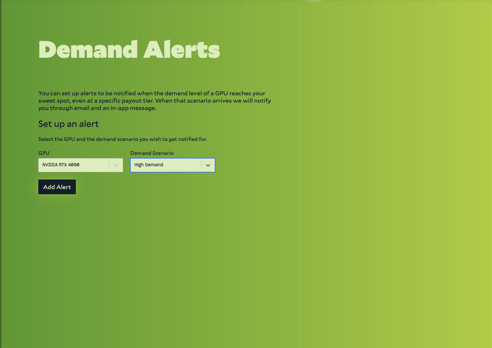

_Last Updated September 9, 2025_

You can set up a Demand Alert to automatically notify you when demand for your hardware increases or decreases on the
Salad Network through our [Network Monitor](/docs/faq/community/613-network-monitor). This is useful if you're not
receiving any Jobs due to low demand for your hardware, and want to be notified when demand increases so you can start
Chopping again.

1. Open the [Network Monitor](https://salad.com/earn/demand) in your web browser.
   
2. Log in with your Salad account if you haven't already.
3. At the top of the page, select 'Get Notified'.
   
4. Select the hardware type you want to be notified about from the dropdown menu.
5. And then select the demand level you want to be notified about. You can choose from 'Low', 'Moderate', or 'High'
   demand levels. 
6. Click 'Add Alert' to save your Demand Alert. You can add multiple Demand Alerts for different hardware types and
   demand levels.

You'll receive an email notification and an in-app notification in the Salad App when demand for your selected hardware
type reaches the specified demand level. You can also unsubscribe from the Demand Alert at any time by clicking the
'Unsubscribe' button from the same page.
