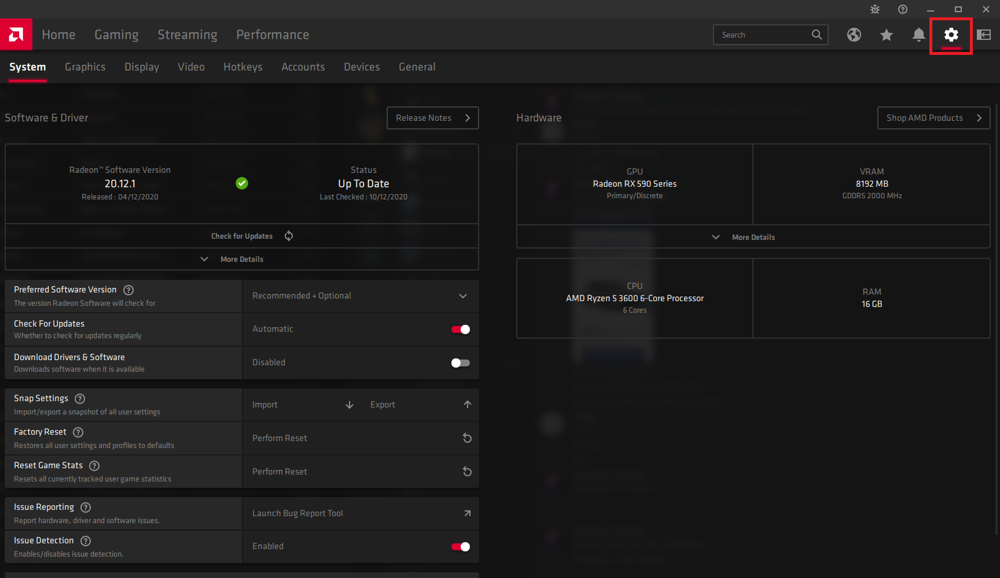
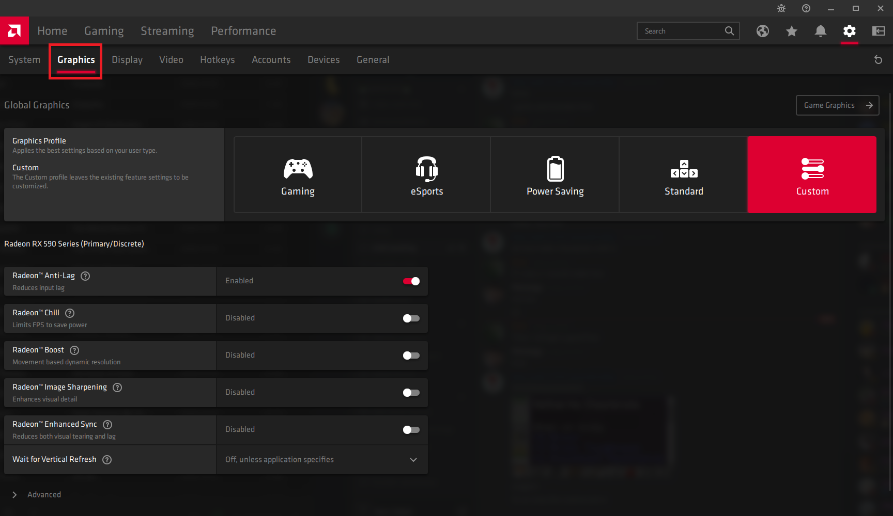
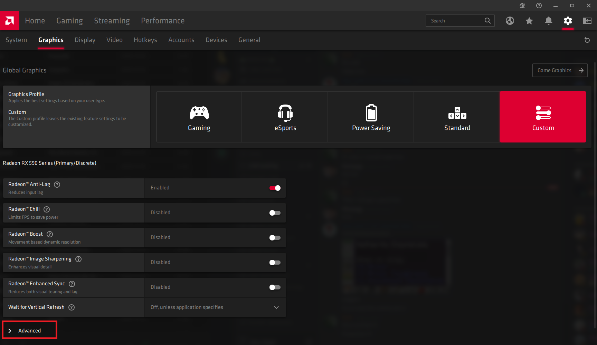
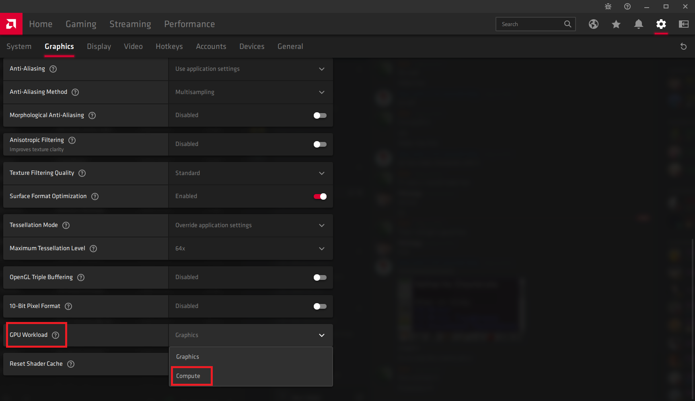
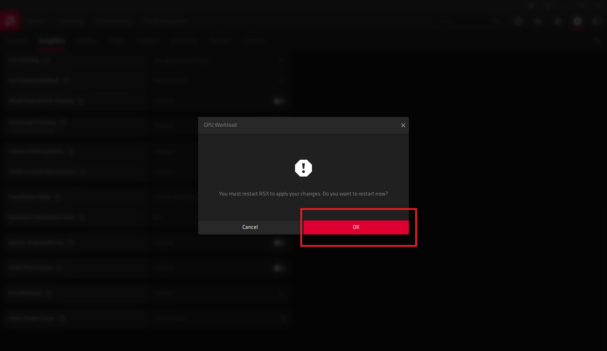

If you are using an AMD Graphics card from the RX 400/500 series, we advise that you enable Compute Mode in your AMD
Radeon Settings, or you may suffer extremely reduced earnings. We advise turning this back to Graphics mode when
intended to game, or you may see slightly reduced FPS in some titles.

These GPUs require Compute Mode to be enabled

- RX 470
- RX 480
- RX 570
- RX 580
- RX 590

To enable this feature, you will need to ensure you are updated to the most Recent AMD Drivers. If you are on older
drivers, you can follow our guide here to [update your drivers](/docs/guides/your-pc/175-how-to-update-my-amd-drivers).
It is also important to make sure to **Turn Off Salad Before Starting.**

---

### Option 1:

1. Pause Salad by clicking the Pause button in your Salad widget
2. [Enable elevated permissions](/docs/faq/salad-app/241-what-are-elevated-permissions-and-should-i-enable-them)
3. Click Start again in your Salad widget

### Option 2:

1. Pause Salad by clicking the Pause button in your Salad widget
2. Open Radeon Settings, and click the Gear icon at the top right

   

3. Click Graphics on the top left

   

4. Scroll down and click Advanced

   

5. Scroll down and select GPU Workload, and set it to "Compute"

   

6. Click OK to restart your GPU Drivers

   

Your screen will turn off and back on again, and then your Drivers should now be in Compute Mode. Starting Salad back up
you should see Salad Chopping at full speed.
