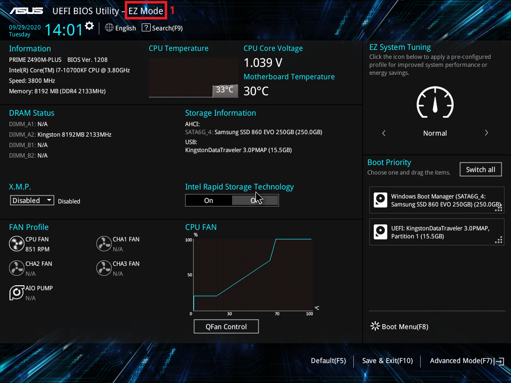
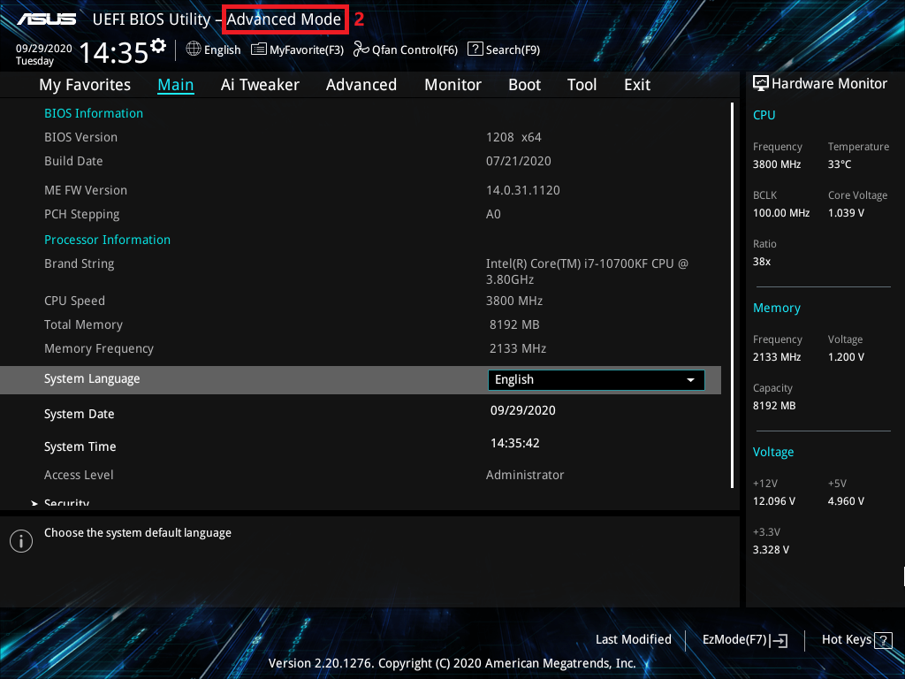
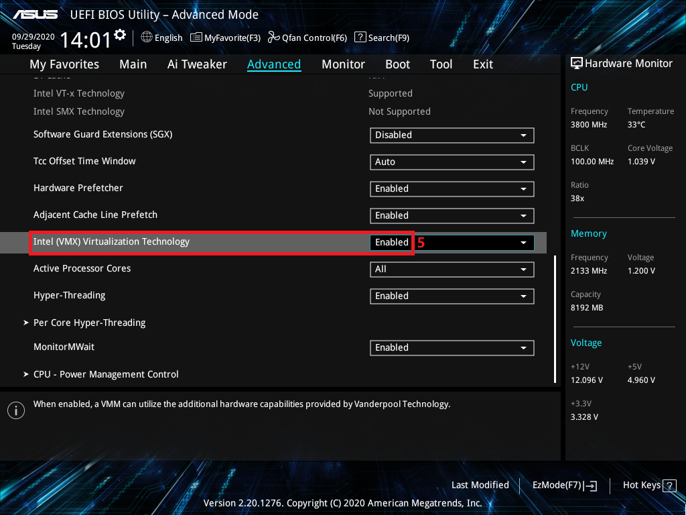
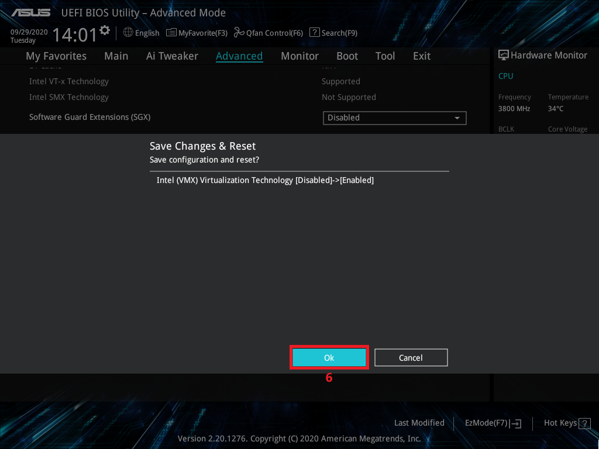
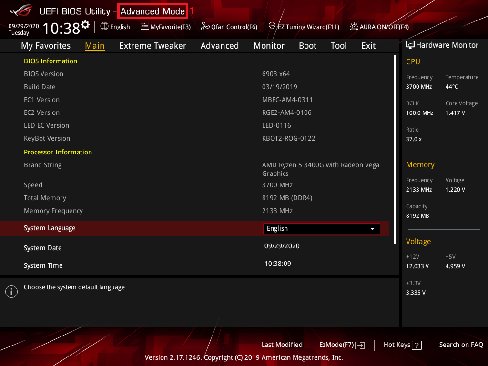
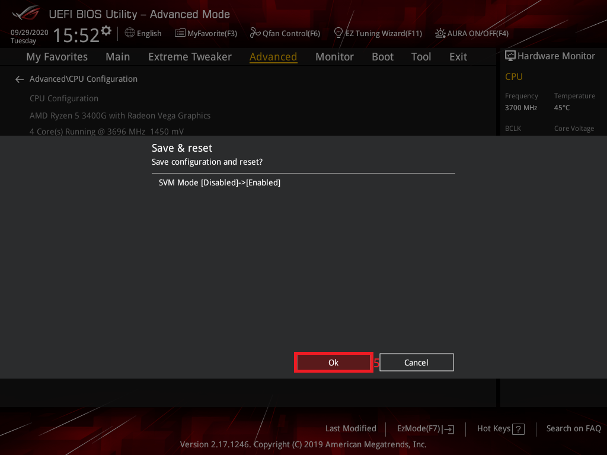

_Last Updated: 23rd October 2025_

Many commercially available PCs allow users to manage their BIOS configuration directly from the startup screen. These
step-by-step guides will help you access and adjust the BIOS settings on prebuilt PCs manufactured by Asus.

If you don't know what kind of CPU you have, please see
[Identifying Your CPU](/docs/guides/your-pc/identifying-your-cpu).

**With Intel Processors**

1. Restart or boot your computer.
2. Immediately press **Del** to access BIOS setup. If your system launches in **BIOS \[EZ Mode]** by default (#1), you
   may need to press **F7** key to access **\[Advanced Mode]** (#2)
   ([source](https://www.asus.com/us/support/faq/1045141/#c))
   ([source](https://www.asus.com/us/support/faq/1045141/#c))
3. Navigate to the **Advanced** (#3) tab with the arrow keys or mouse.
4. Click or hit enter to expand the **CPU Configuration** (#4) settings.

   ([source)](https://www.asus.com/us/support/faq/1045141/#c)

5. Scroll down and enable **Intel (VMX) Virtualization Technology** (#5).

   ([source)](https://www.asus.com/us/support/faq/1045141/#c)

6. Press **F10** and click "OK" (#6) to save your configuration and exit.

   ([source)](https://www.asus.com/us/support/faq/1045141/#c)

---

## With AMD Processors

1. Restart or boot your computer.
2. Immediately press **Del** to access BIOS setup. If your system launches in **BIOS \[EZ Mode]** by default, you may
   need to press **F7** key to access **\[Advanced Mode]** (Fig. 1)

   ([source](https://www.asus.com/us/support/faq/1045141/#c))

3. Navigate to the **Advanced** tab with the arrow keys or mouse.
4. Click on the **CPU Configuration** settings from the menu.

   ([source](https://www.asus.com/us/support/faq/1045141/#c))

5. Scroll down and enable **SVM Mode**.

   ([source](https://www.asus.com/us/support/faq/1045141/#c))

6. Press **F10** and click "OK" to save your configuration and exit.

   ([source)](https://www.asus.com/us/support/faq/1045141/#c)
