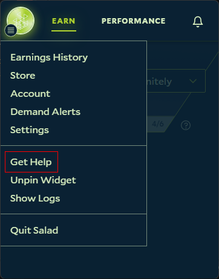
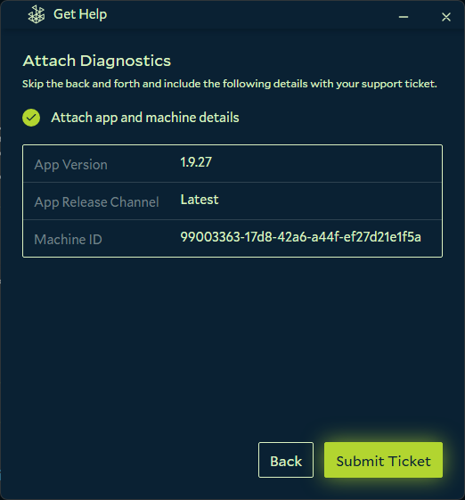
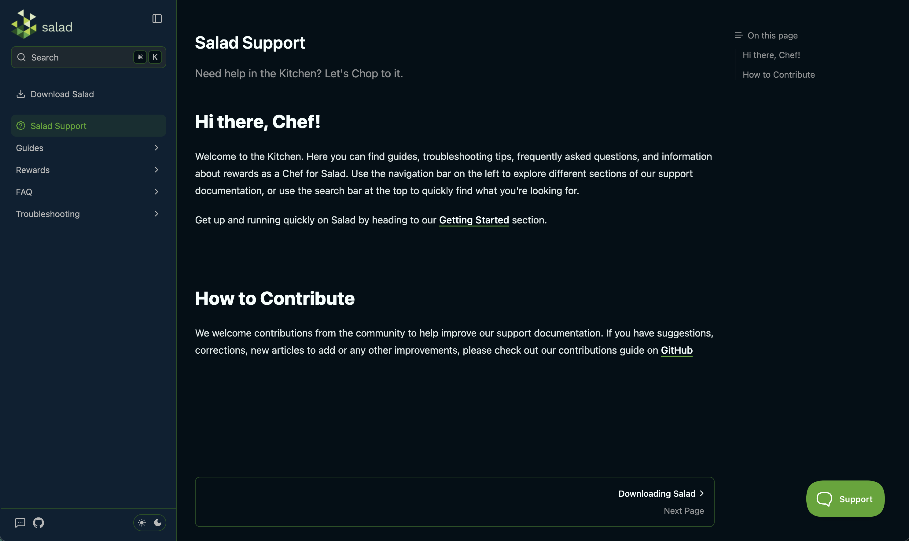
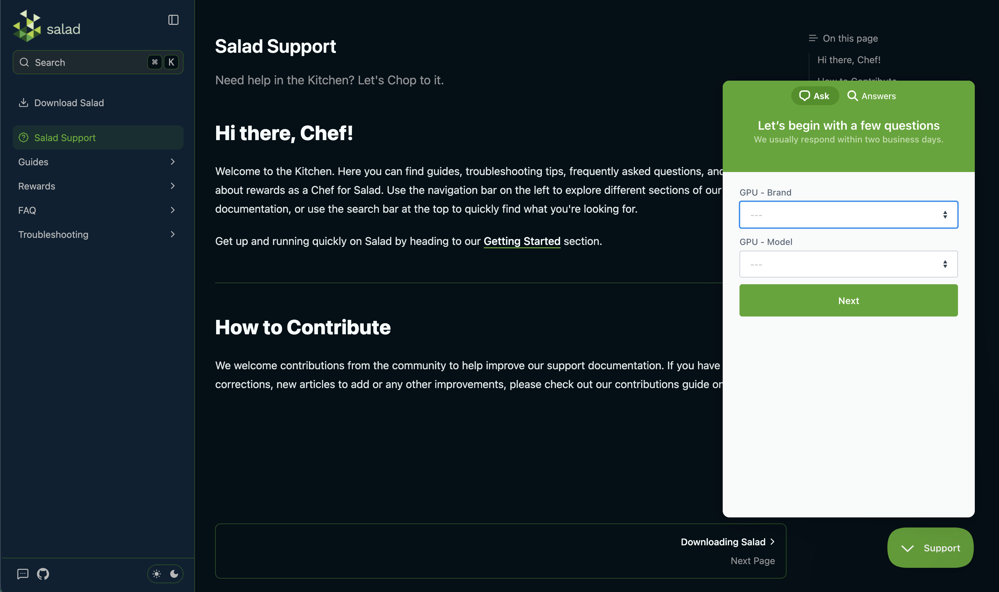

## Salad Ticket Requirements

Before you submit a support ticket, please make sure you provide the following information to help us assist you as
quickly as possible:

- A description of the issue you're experiencing, including any error messages you may have received.
- Relevant information such as your machine's hardware (CPU, GPU, RAM, etc) and/or machine ID. If you are submitting a
  ticket from the Salad Application, this will be automatically included.

You may also find a quicker solution to your issue by searching our [Knowledge Base](https://support.salad.com/hc/en-us)
before submitting a ticket.

## How to Submit a Support Ticket

### Using the Salad Application

1. Open the Salad Application and click your profile icon in the top left corner of the widget, then select "Get Help"
   from the drop-down menu.

   

2. A window will open where you can describe your issue and submit your ticket. Please make sure to include all relevant
   information so we can assist you as quickly as possible. Once you've filled out the form, click the "Next" button and
   you'll be asked if you want to include your machine details before submitting the ticket.

   

3. Salad Support will respond to your ticket via email, so please make sure to check your inbox for a response!

### Using the Salad Website

1. Navigate to [https://support.salad.com](https://support.salad.com) or any page on
   [https://salad.com/store](https://salad.com/store).

   

2. Click the "Support" widget at the bottom right, this will open a window.

   

3. Let us know what your issue is, and hit the "Send a message" button to submit your ticket.

If you are unable to access this page, or cannot see the "Contact Us" option, you can instead send us an email to
[support@salad.com](mailto:support@salad.com?subject=I%20need%20help%20with%20Salad%21&body=Hi%20there%21%20I%20need%20help%20with..).

Simply click the email address, and it'll pop open your default mail client ready to send us an email! Alternatively you
can enter it as the "To" address in your favorite mail service. _You will need to make sure you submit your ticket from
the same email address that's connected to your Salad account, or we may not be able to provide assistance on some
issues in order to keep your account secure._

---

If you need to upload log files to your ticket, you can do so by following these instructions:
[How to find your Salad log files](/guides/using-salad/how-to-find-your-salad-log-files).

You can view your active, and past tickets and chats within the widget by selecting "previous conversations" on the main
menu if available. You can also reply to your support tickets through here as well.
