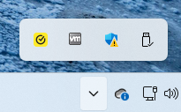
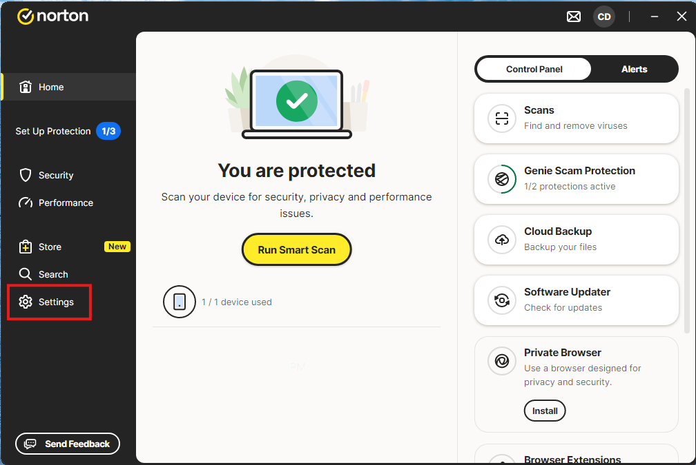
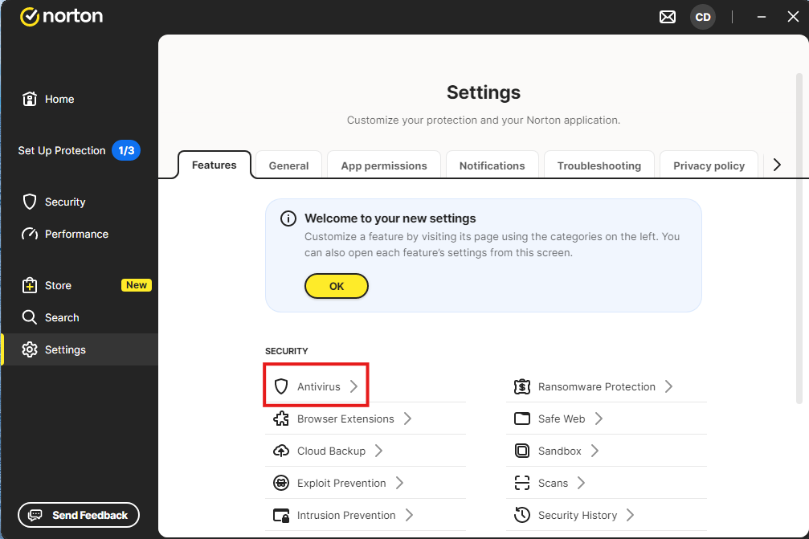
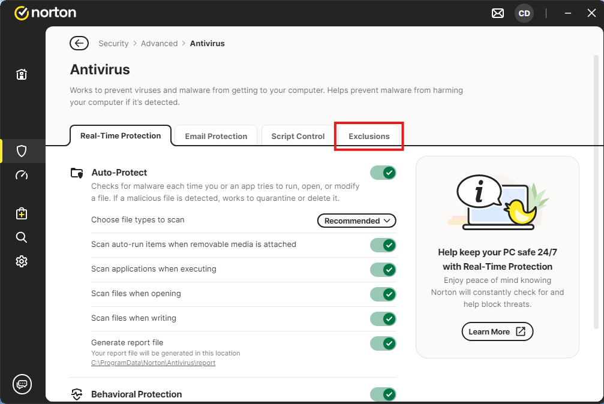
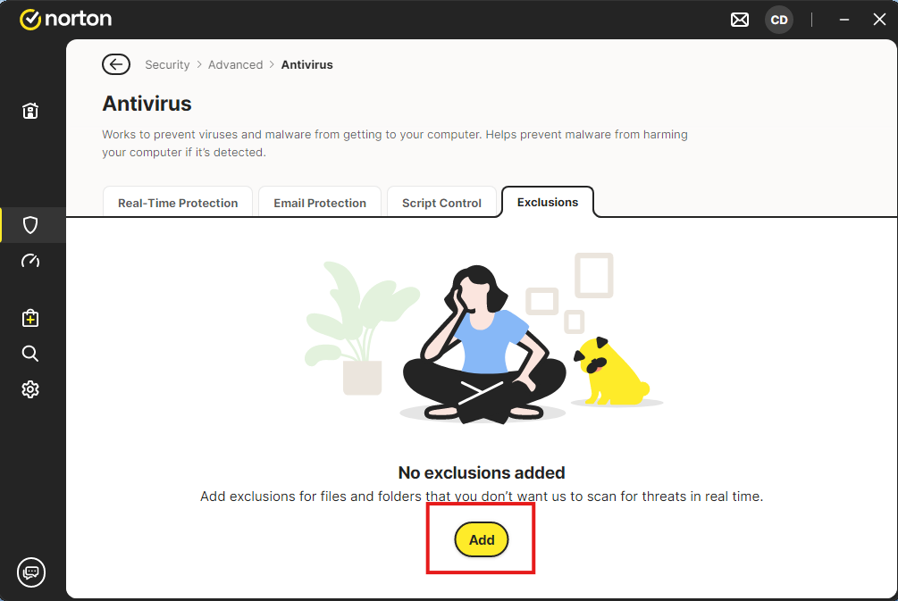
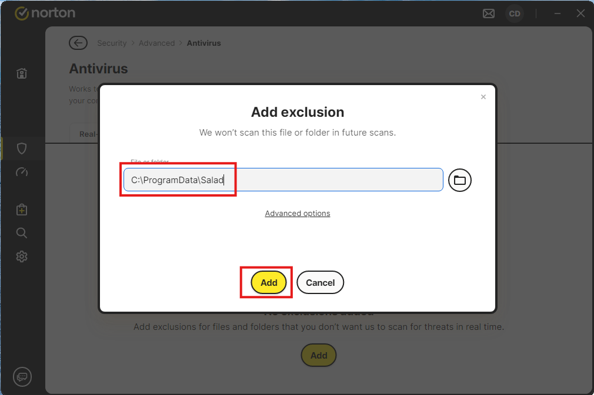

**1. Open Norton360.**

**2. From the main menu, click Settings on the left navigation bar.**

**3. Then, select Antivirus from the options near the bottom.**

**4. Click exclusions on the far right.**

**5. Then click Add.**

**6. In the window that opens, you're going to enter C:\ProgramData\Salad to whitelist Salad, then click Add.**

Contact [Salad Support](/docs/guides/your-pc/216-how-to-create-a-support-ticket) if this issue persists.
