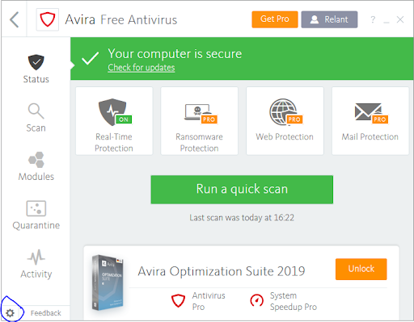
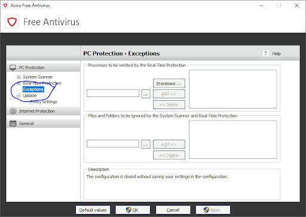
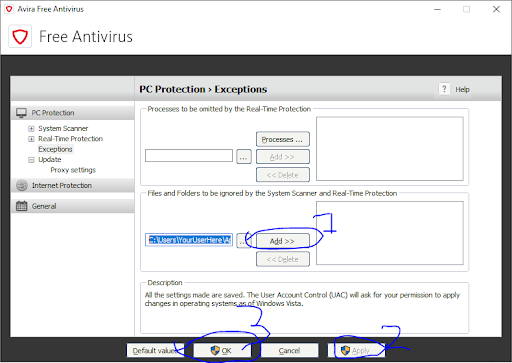

### 1. Open Avira

**This will be the main screen you are presented within Avira, and is your base of virus-fighting operations.**

****

### 2. Navigate to Settings

**To access the settings of Avira, click on the little gear situated on the bottom left corner of the main screen.**

****

### 3. Adding an Exclusion

**To add an exclusion in Avira, click on 'Exclusions' right under 'Real-Time Protection' which is situated on the 'PC
Protection' tab.**

****

### 4. Adding Salad as an Exclusion

After clicking on 'Exclusion', your exclusion settings will appear. Under the Files and Folder area, you'll want to
navigate the Salad miner folder in the dialogue box, the path for this is "C:\\ProgramData\\Salad\\workloads" Then,
click on 'Add'. After that, click on 'Apply' then again, click 'Ok'.\*\*

****

### 5. Click Ok

**Once you've found your Salad installation and clicked it, hit 'Add'. After that click 'Apply' then again, click 'Ok'.
After doing that, you will see your Salad exclusion on the main Avira Exclusion whitelist page.**

### 6. Run Salad

Open your Salad widget and click the play button. If this issue persists, contact [Salad Support](/contact).
