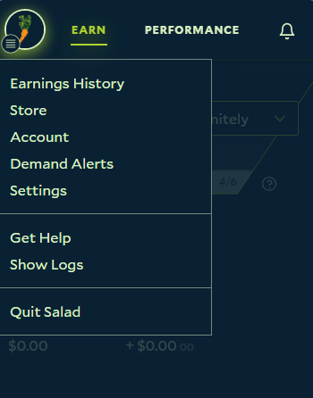
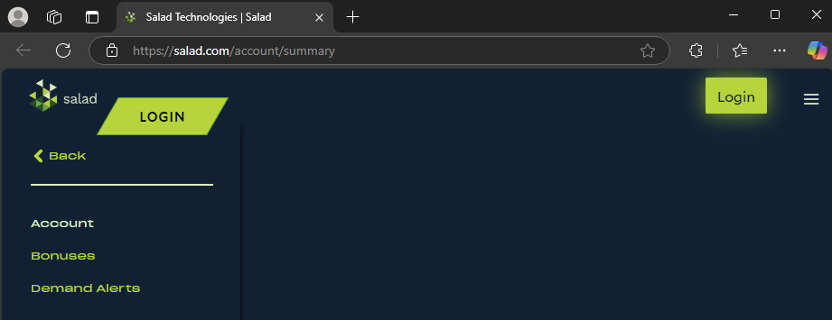
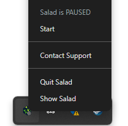
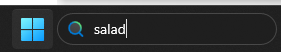
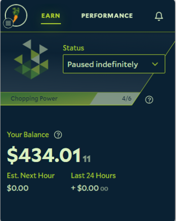
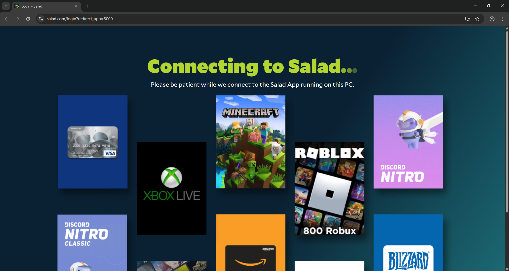
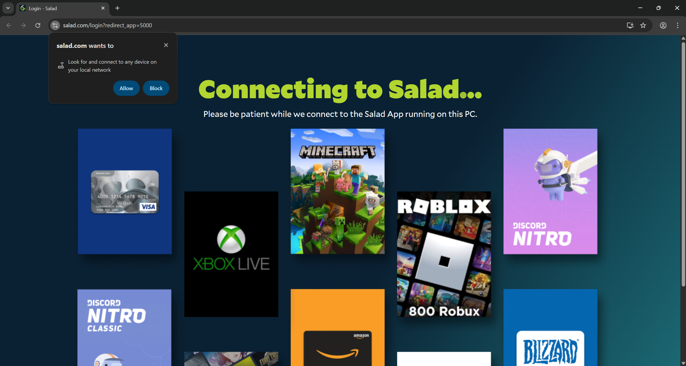
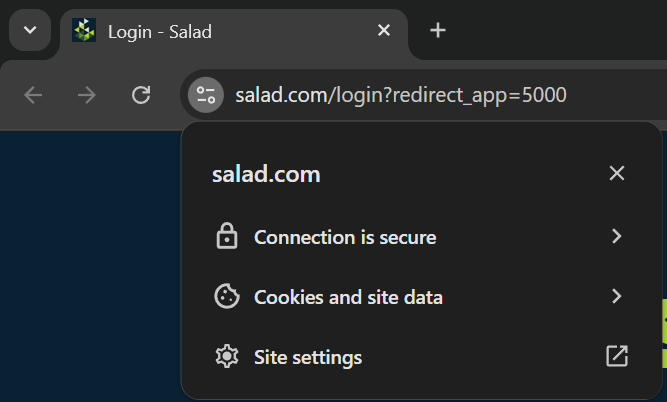
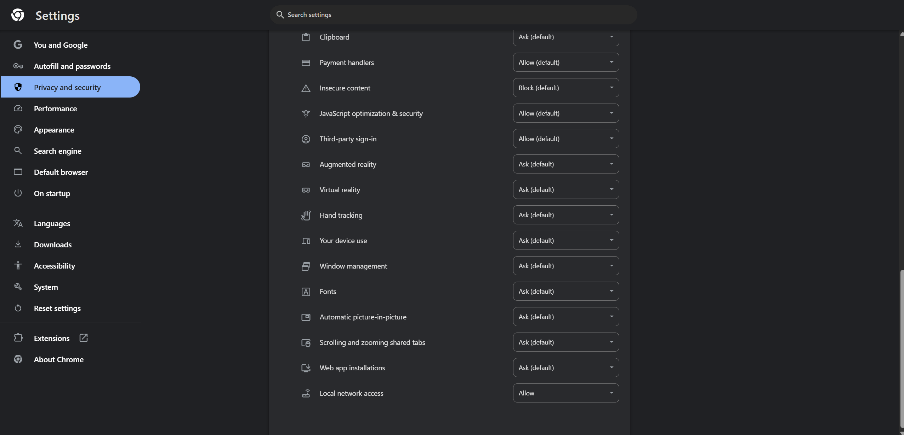
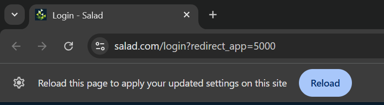

import { Callout } from 'fumadocs-ui/components/callout'

<Callout type="error">

Salad does not offer support for Chefs running Salad in Virtual Machines (VMWare, VirtualBox, Proxmox, etc), which can
cause Salad to stop working properly - our support team will not help investigate issues.

Most Remote Desktops relying on RDP will cause the above issue - please uninstall these from your system and reinstall
Salad should you encounter this issue.

</Callout>

## Use a Supported Web Browser

Ensure that the web browser you're using is supported by Salad. Some supported browsers include:

- [Google Chrome](https://www.google.com/chrome/)
- [Microsoft Edge](https://www.microsoft.com/en-us/edge)
- [Mozilla Firefox](https://www.firefox.com/)

Some browsers have protection settings enabled which conflict with Salad, some popular examples include:

- Brave Browser
- Safari

These, along with other privacy-centric browsers may pose similar problems.

### Selecting a Supported Web Browser

1. Find your Salad Widget in the System Tray or Overflow Tray

   

2. Click the Salad Widget icon and open the Salad Widget Menu at the top left

   

3. Click 'Account' within the Salad Widget Menu, you should be redirected to the Salad Account Summary web browser page,
   within your default web browser.

   

4. From here, you have two options:
   1. If your device's default web browser is unsupported by Salad, simply copy and paste the URL above into a supported
      web browser, such as Google Chrome, Firefox, or Microsoft Edge.
   2. You can also temporarily, or permanently, change your device's default web browser to a supported web browser.
      This will change where the Salad Account URL redirects to by default. Here's more on how to change your default
      web browser:
      1. [How to Make Google Chrome Your Default Web Browser](https://support.google.com/chrome/answer/95417?hl=en&co=GENIE.Platform%3DDesktop)
      2. [How to Make Microsoft Edge Your Default Web Browser](https://support.microsoft.com/en-us/windows/change-default-apps-in-windows-e5d82cad-17d1-c53b-3505-f10a32e1894d)
      3. [How to Make Mozilla Firefox Your Default Web Browser](https://support.mozilla.org/en-US/kb/how-change-your-default-browser-firefox-windows)

---

## Try Restarting the Salad App and/or Your Machine(s)

Sometimes a simple restart can solve common connection issues. Please try these troubleshooting steps:

### Restart your Salad App:

1. Open the Windows System Tray or Overflow Tray and find the Salad Widget icon

   

2. Right click the Salad Widget icon, then click "Quit Salad"

   

3. Search for Salad in your Windows Search Bar

   

4. Find the Salad App and click it to restart Salad. If the connection was successful your Salad Widget should
   automatically open.

   

### Restart your Machine

Simply follow these instructions for safely restarting a Windows machine:

- [How to Restart (Reboot) Your Windows Machine](https://support.microsoft.com/en-us/windows/restart-reboot-Your-PC-110262aa-fc79-1c33-7b00-c140ae3a6dac)

---

## Using a recent version of Chrome?

Newer versions of Chrome now require an extra permission in order to finalize the login process. After installing Salad
on your machine and logging in (or signing up), you may remain stuck on the following screen:

In order to continue with the login process and ensure the app itself is logged in, you will need to allow "Local
network access" to the site. In some cases, this option will be requested from you, and you should click "Allow" to
authorize the login process, like so:

Should the browser not display this tooltip, you can also manually authorize it by:

- In the top left, next to the URL, click the "toggle" symbol
- Then, towards the bottom of the tooltip, click "Site Settings"

- At the "Privacy and Security" page (which you should be automatically redirected to), scroll to the bottom until you
  find the "Local network access" permission, and set it to "Allow"

- You can then go back to the previous page (the Salad login page), and reload the tab

- After the tab finishes to reload, the login process should now continue successfully

### Why does Salad need this permission?

When you press the login button in the app, Salad sends a request to your browser to start the login process, and then
waits for confirmation from the browser that you are logged in to receive the account information. Any access required
by a website to a local machine (including to services running directly on your machine - like Salad) now need to be
approved via this permission. Salad only uses this permission to complete the login process, and does not actively
access other machines or services on your machine.

<Callout type="info">
If you are not comfortable with keeping this option in an allowed state, you can also set it to blocked (or Ask) once
the login process has ended - in which case you will need to repeat this process the next time the app requests you to
log in.
</Callout>

---

## Get in Touch with Support

If your connection issues persist, please reach out to [Salad Support](/contact), and our team will get back to you as
soon as possible.
